# quickcenter.koplugin

> **Quick Actions + Control Center for KOReader — a fast, configurable, gesture-friendly shortcut hub.**

> **Author**: [Arin-Chin](https://github.com/Arin-Chin) · **License**: AGPL-3.0 · **Compatible**: KOReader (LuaJIT)

---

## Overview

QuickCenter is a standard KOReader **plugin** migrated from the patch
`koreader/patches/2-quickcenter.lua` (kept in this repository's history for reference).
It is loaded through the official PluginLoader: `main.lua` is only executed while the
plugin is **enabled**, and it never writes to `_G`.

| Feature | Description |
| :--- | :--- |
| **Quick Actions** | Frequent actions of 5 types: folder, collection, plugin/patch, system, recording; run them from the shortcut menu or by gesture |
| **Control Center** | A one-tap action panel injected as the first menu tab (Filemanager & Reader), with layout, shape, slider, filter and gesture-behavior options |
| **Icons & Fonts** | Icon picker (Nerd Font / SVG / PNG), system icon replacement, and whole-UI font switching (Regular / Bold / Mono) |

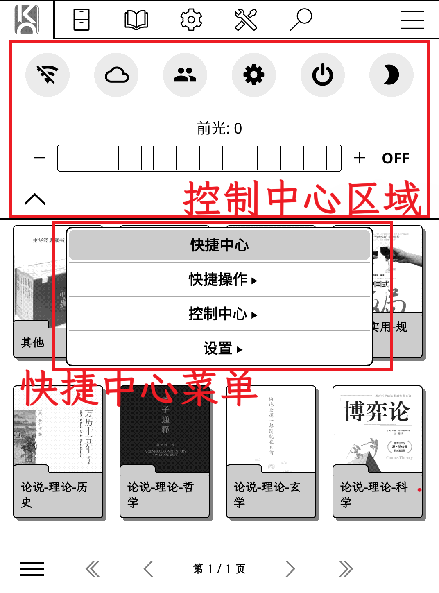

### 📦 Quick install

| Step | Action |
| :--- | :--- |
| 1 | Download the runtime-only zip from **Releases**, or clone this repository, then copy the `quickcenter.koplugin` folder into `<koreader>/plugins/` |
| 2 | KOReader → gear **Tools → Plugin manager → User plugins** → enable `QuickCenter` |
| 3 | Restart KOReader |

> ⚠️ **Mutually exclusive with the old patch.** Do **not** install
> `2-quickcenter.lua` into `koreader/patches/` while this plugin is enabled — both inject
> the same menu tab and settings entry.

| Scenario | Recommendation |
| :--- | :--- |
| Following upstream patch releases closely | Keep using the patch form (see repository history) |
| Want standard enable/disable via the Plugin manager | Use this plugin |

> 💡 **Inspiration**: [kopatches](https://github.com/gytwo/kopatches)

---

## Core Features

### 1. Quick Actions

| Feature | Description |
| :--- | :--- |
| **Custom actions** | 5 types: folder / collection / plugin / system (Dispatcher) / **recorded menu action** |
| **Menu recording** | Record any menu path as a reusable action; its view is customizable when editing |
| **Edit actions** | Add / rename / delete from the edit card; custom actions live under *Custom actions* while built-ins stay under *Built-in actions* |
| **Status marks** | `≡` = included in the shortcut menu · `⊚` = saved as a Control Center button (shown before the name; managed via the edit card) |
| **Shortcut menu** | Add/remove from the edit card toggle; a gesture can open the runnable list without a title bar |

<table>
  <tr>
    <td>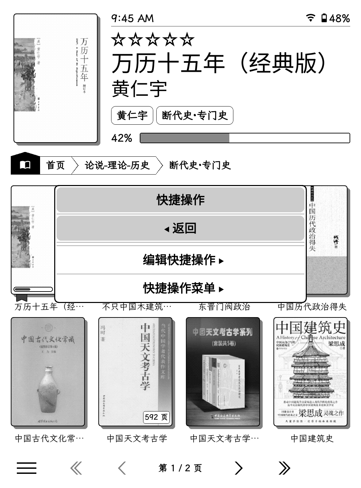</td>
    <td>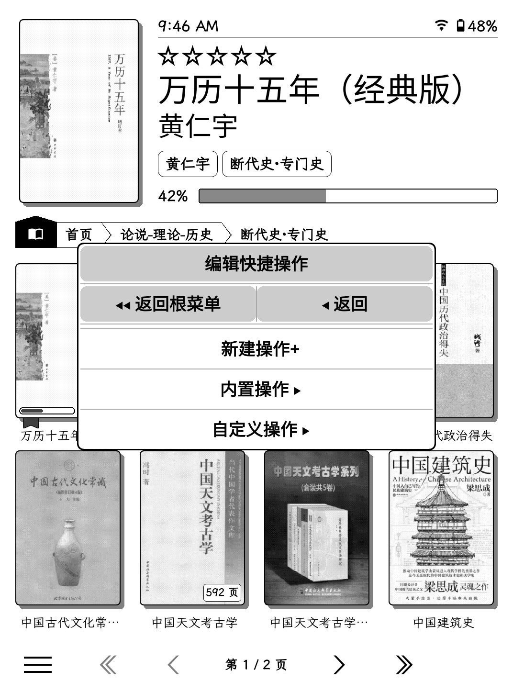</td>
    <td>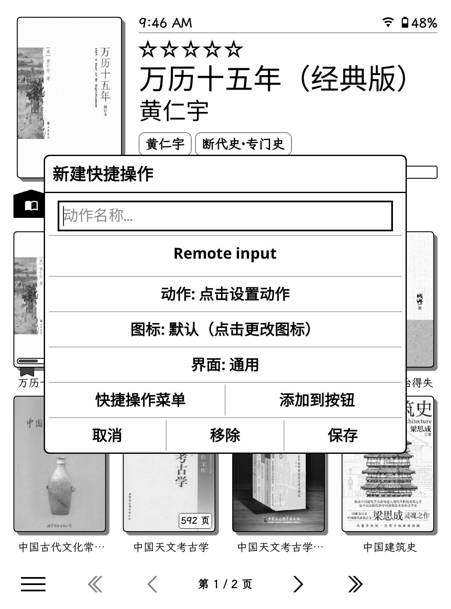</td>
    <td>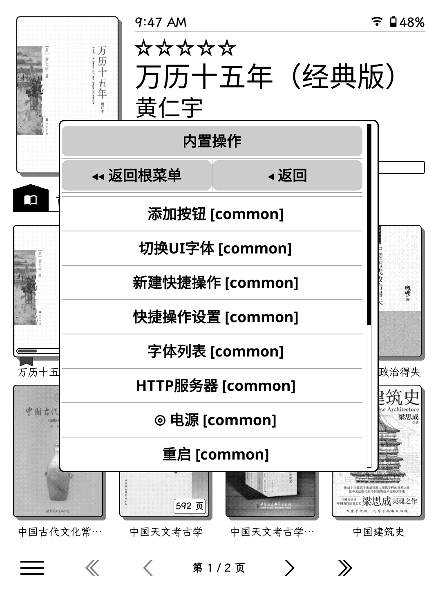</td>
  </tr>
</table>

<table>
  <tr>
    <td>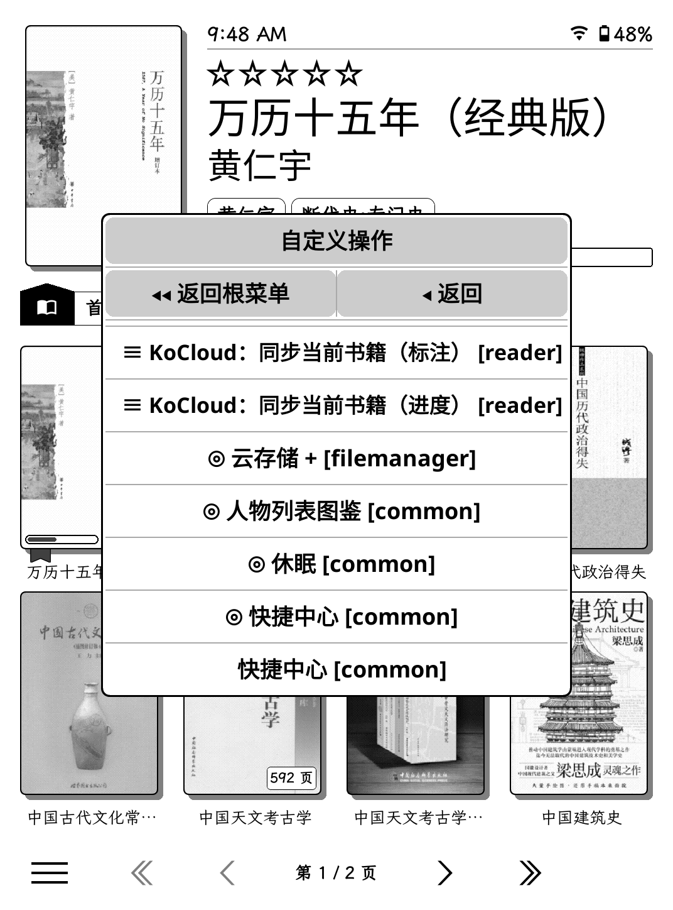</td>
    <td>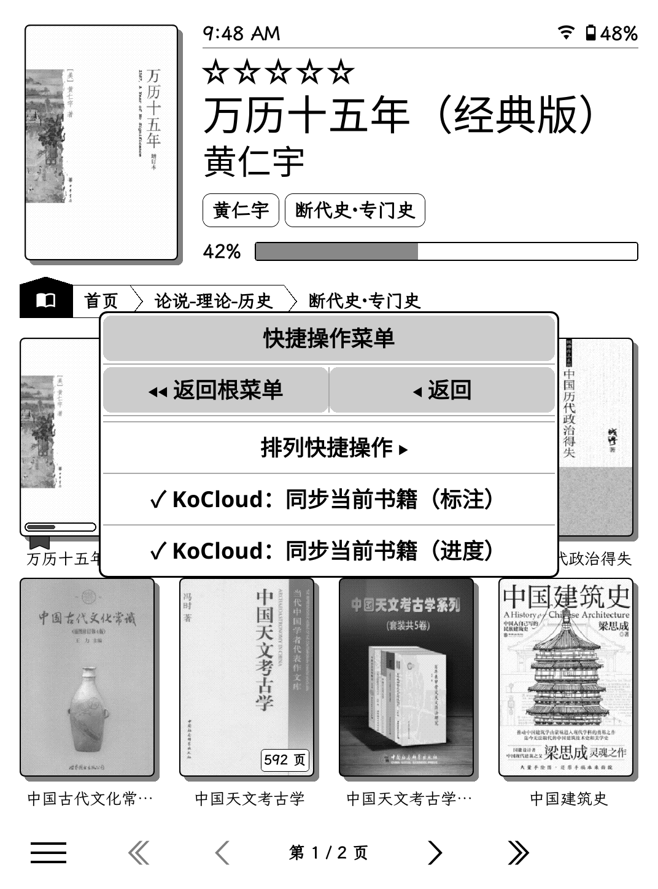</td>
    <td>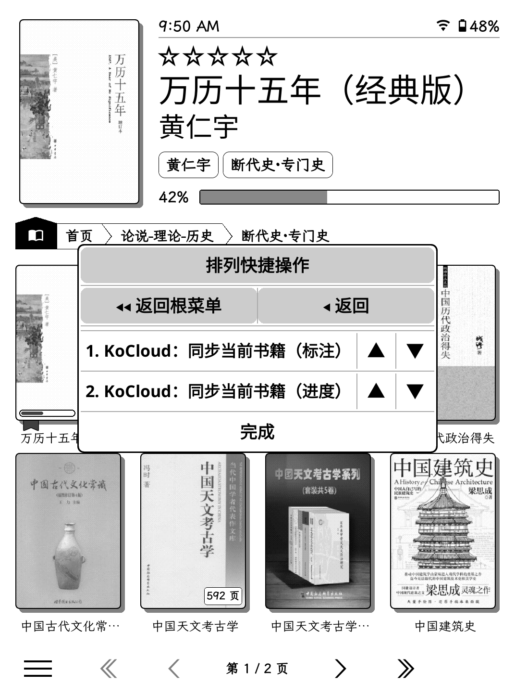</td>
    <td>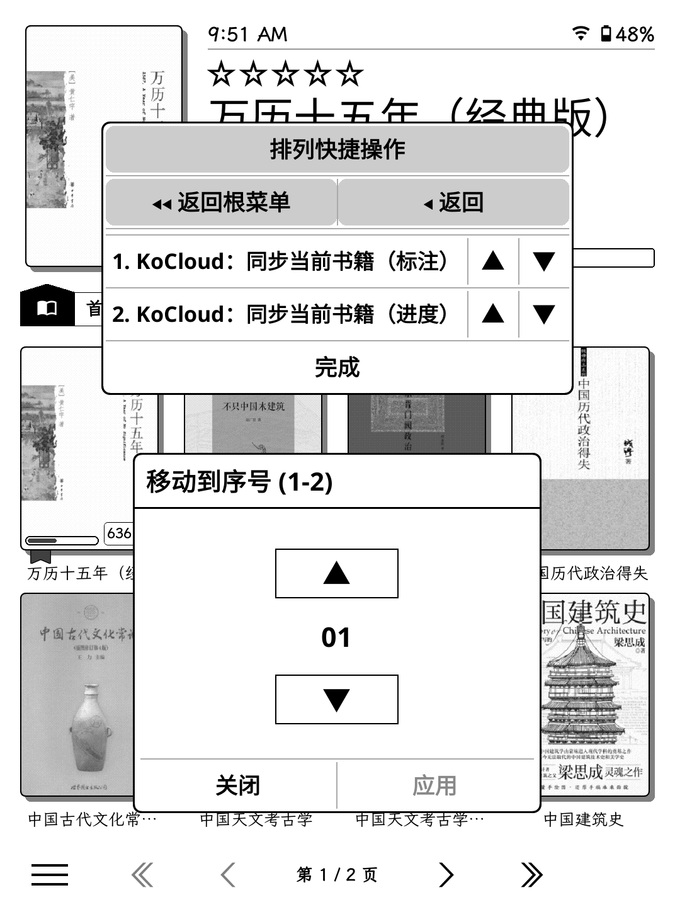</td>
  </tr>
</table>

### 2. Control Center

A customizable action panel injected as the **first tab** of the top menu (Filemanager &
Reader), plus everything about its buttons.

| Setting | Options / Description |
| :--- | :--- |
| **Built-in actions** | Wi-Fi / night mode / rotate / screenshot (4 s) / continue reading / search / restart / quit / power / HTTP server / font list / switch UI font |
| **Arrange buttons** | Reorder panel buttons with ▲ / ▼ (QuickCenter-style box, back navigation) |
| **Edit buttons** | List of actions currently saved as panel buttons; tap or hold a row to remove it (same as clearing *Added to buttons* in the edit card) |
| **Button layout** | Auto (flow by panel width) / fixed grid (**rows × buttons per row**) |
| **Interface filter** | Show / hide actions per context: Filemanager / Reader / Common |
| **Button shape** | Round / Rounded square / Bare |
| **Button background** | Transparent / Solid / Light gray |
| **Slider style** | Line / Segmented |
| **Button size** | 60% ~ 150% (step 5%, default 100%) |
| **Label size** | 50% ~ 200% (step 10%, default 90%) |
| **Show labels** | Toggle |
| **Hold behaviors** | Hold a button → edit · hold the panel → open settings |
| **Status bar** | Bottom-right status bar of the Control Center panel: enable/disable and pick items (time / date / battery / Wi-Fi / frontlight / warmth); long-press an item to edit its format (strftime for time/date, placeholders such as `{value}`, `{level}`, `{symbol}`, `{on}`, `{off}`) |
| **Frontlight / warmth sliders** | With optional value display and Min / Max shortcuts (requires device support) |

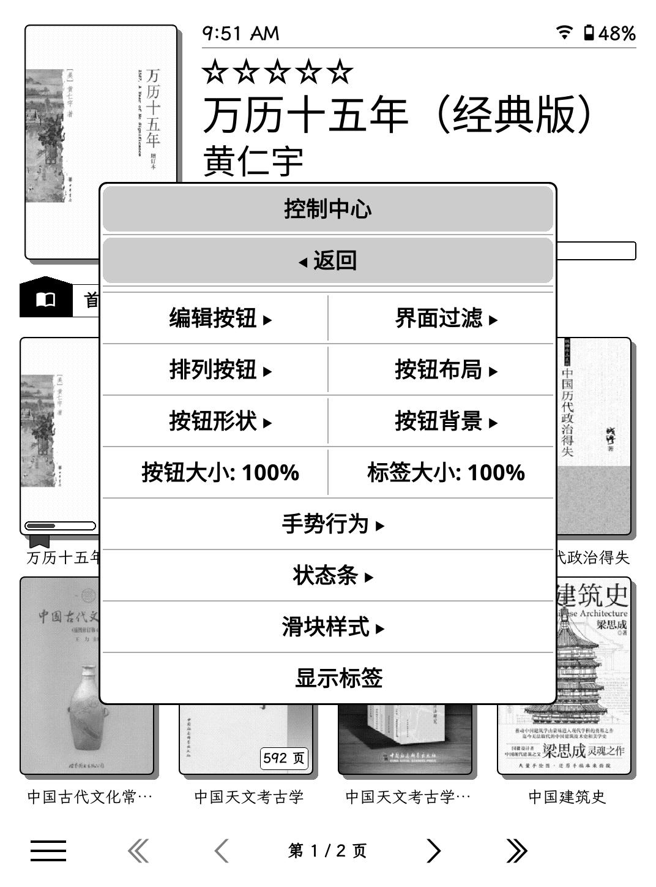

### 3. Settings

Settings are opened via the menu entry or the `qa_settings_action` gesture.

| Feature | Description |
| :--- | :--- |
| **Enable QuickCenter** | Enable / disable the panel tab (restart required) |
| **Config management** | Named presets: **Save** · **Edit** · **Reset** |
| **Appearance** | Panel tab icon · system icon replacement · UI font switching |

#### Config management

| Function | Description |
| :--- | :--- |
| **Save config** | Store the current configuration as a **named preset** |
| **Edit config** | Browse presets: **long-press to apply** that preset to the current settings; open the submenu for update / rename / delete |
| **Reset config** | Restore factory defaults |

> Presets can be saved, overwritten and restored at any time — handy for switching between
> reading / night / travel setups.

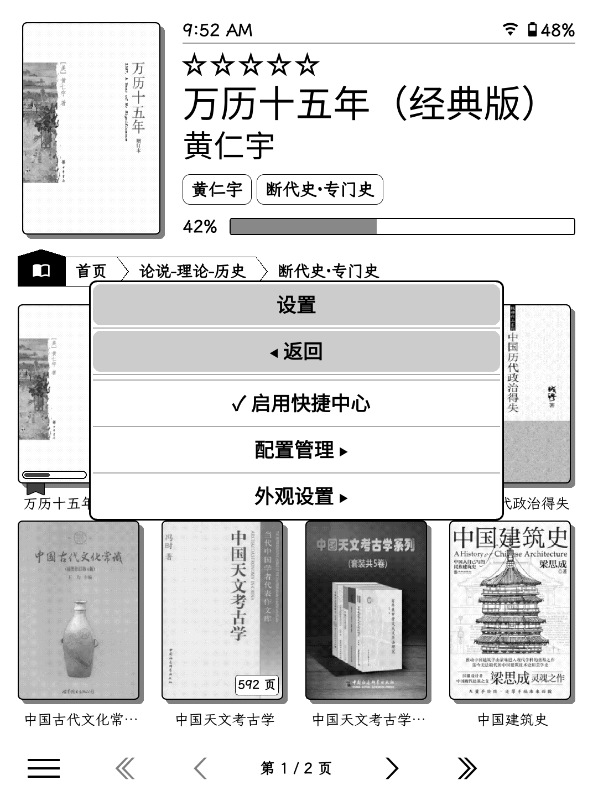

#### Icon picker

| Source | Description |
| :--- | :--- |
| **Nerd Font** | Auto-scanned glyphs of the symbols font, with codepoint search |
| **SVG / PNG files** | Browse `koreader/icons/` and built-in icon dirs, with name filter |
| **System icon replacement** | Replace KOReader built-in icons (grid preview, batch apply / reset) |

#### UI font switcher

Replace the whole UI font (Regular / Bold / Mono) from installed fonts, with a live
preview and one-tap reset.

---

## Support

| Entry | Location |
| :--- | :--- |
| **QuickCenter settings** | gear **Tools → More tools → QuickCenter** |
| **Control Center panel** | First tab of the top menu (configurable icon) |

| Gesture action | Dispatcher key | Description |
| :--- | :--- | :--- |
| Control Center panel | `quick_actions_panel` | Open the Control Center panel tab |
| QuickCenter settings | `qa_settings_action` | Open QuickCenter settings |
| Shortcut menu | `qa_shortcuts_menu` | Open the runnable shortcut list (no title bar) |

> Gesture bindings survive restarts — bind under gear → Gesture manager, stored in
> `koreader/settings/dispatcher.lua`. Action titles are localized together with the UI
> language.

**Enable / disable**: disable the plugin in the Plugin manager and restart — the menu
entry, panel tab, gesture actions and font/icon patches are no longer injected (they only
exist while the plugin's `main.lua` is loaded). The plugin framework does not unwrap
patches at runtime, so always restart after toggling; a stale gesture on the three action
names is a silent no-op while disabled.

---

## File Structure

```
quickcenter.koplugin/            # repository root == plugin root
├── main.lua                     # entry: plugin class & lifecycle, action registry,
│                                #   panels/dialogs, TouchMenu patch installation
├── qc_config.lua                # config leaf module: defaults, serialize, atomic
│                                #   save/load, setting accessors
├── qc_scan.lua                  # plugin/patch scanner leaf module (PluginScan)
├── qc_uifont.lua                # UI font switcher leaf module
├── qc_icons.lua                 # icons leaf module: Nerd Font, pickers, caches
├── _meta.lua                    # plugin metadata (shown when disabled)
├── pictures/                    # screenshots (referenced by both READMEs)
├── README.md                    # documentation (English)
└── README.zh_CN.md              # documentation (简体中文)
```

| File | Purpose |
| :--- | :--- |
| `main.lua` | Plugin entry: Quick Actions + Control Center + config management + icon/font tools |
| `qc_config.lua` | Configuration storage & accessors (sole leaf dependency of other modules) |
| `qc_scan.lua` | Plugin/patch discovery & menu-item tree search |
| `qc_uifont.lua` | Whole-UI font replacement & picker dialogs |
| `qc_icons.lua` | Nerd Font glyphs, icon cache, file/system icon pickers |
| `_meta.lua` | Plugin metadata for the Plugin manager |
| `pictures/` | Screenshots referenced by the READMEs |
| `README.md` / `README.zh_CN.md` | Bilingual docs (mirrored structure) |

> `spec/` (config unit tests) and `.luacheckrc` are local development helpers and are intentionally not tracked in this repository; the release package contains runtime files only.

---

## Configuration

All settings live in `koreader/settings/quickcenter.lua` (auto-generated on first run;
an existing file from the patch era is reused as-is — no migration needed).

| Group | Keys | Description |
| :--- | :--- | :--- |
| Panel | `qa_enabled` / `qa_slots` / `qa_*` | Panel enable, button order, shape, size, labels, sliders |
| Layout | `qa_layout_*` | Fixed button grid (enabled / rows / buttons per row) |
| Status bar | `qa_statusbar_enabled` / `qa_statusbar_items` / `qa_statusbar_formats` | Panel bottom-right status bar toggle, displayed items and per-item format overrides |
| Shortcuts | `qa_shortcuts` | Actions added to the shortcut menu |
| Presets | `saved_configs` | Named configuration presets |
| Appearance | `qa_tab_icon` / `qa_icon_overrides` / `ui_font_overrides` | Panel tab icon, system icon replacement, UI fonts |

---

## Internationalization

| Item | Description |
| :--- | :--- |
| Mechanism | UI strings are wrapped with gettext `_()`; labels follow KOReader's UI language |
| Default language | Simplified Chinese (fallback text embedded in code) |
| Translation files | No `.po` catalog shipped in this repository (KOReader l10n flow) |

---


## Compatibility

| Item | Requirement |
| :--- | :--- |
| KOReader | Recent build (LuaJIT); verified on v2026.07 |
| Device | Frontlight / warmth sliders require device support |
| Icons | Nerd Font feature requires a Nerd Font symbols face |
| Dependencies | None beyond KOReader core APIs (no external library, no `os.execute`) |
| Configuration | `quickcenter.lua` schema unchanged since the patch era (`version = 1`) |

---

## Developer Info

- **Author**: [Arin-Chin](https://github.com/Arin-Chin)
- **License**: AGPL-3.0 — see [gnu.org/licenses/agpl-3.0.en.html](https://www.gnu.org/licenses/agpl-3.0.en.html)


