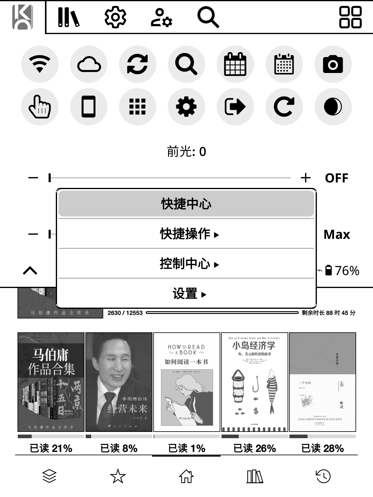
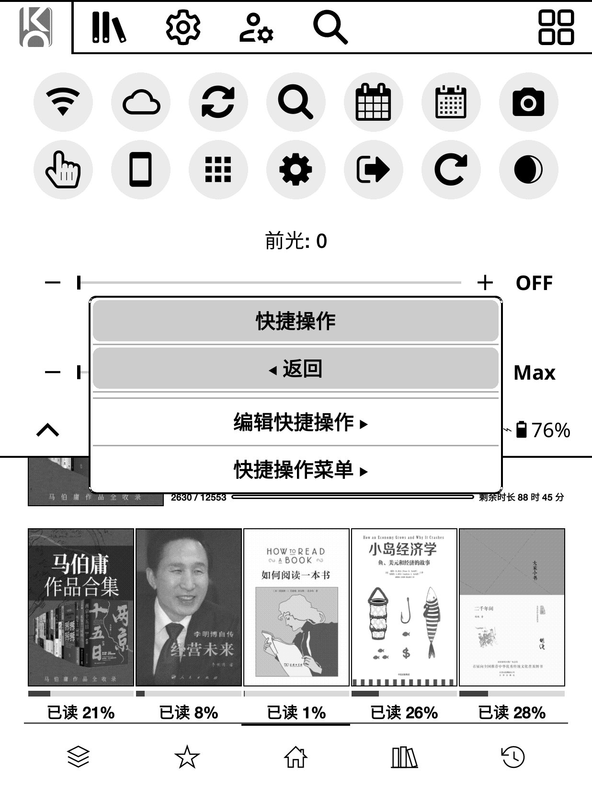
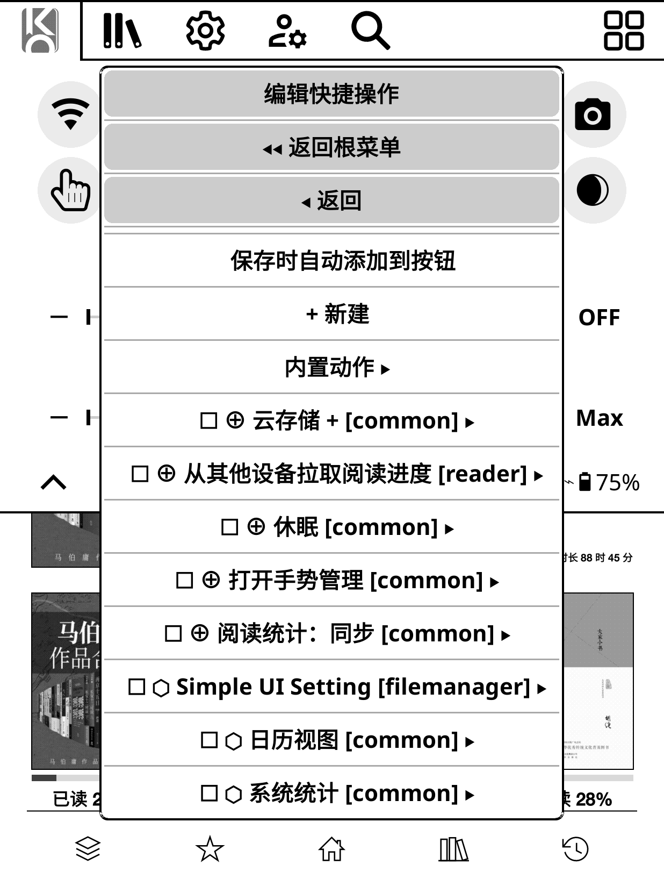
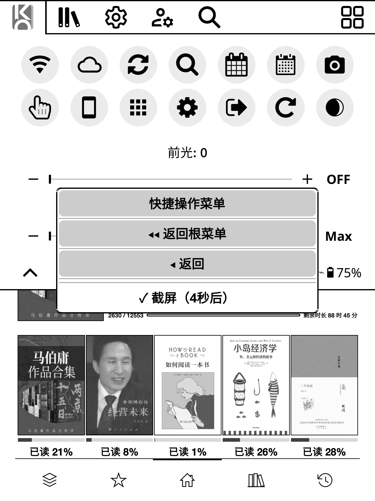
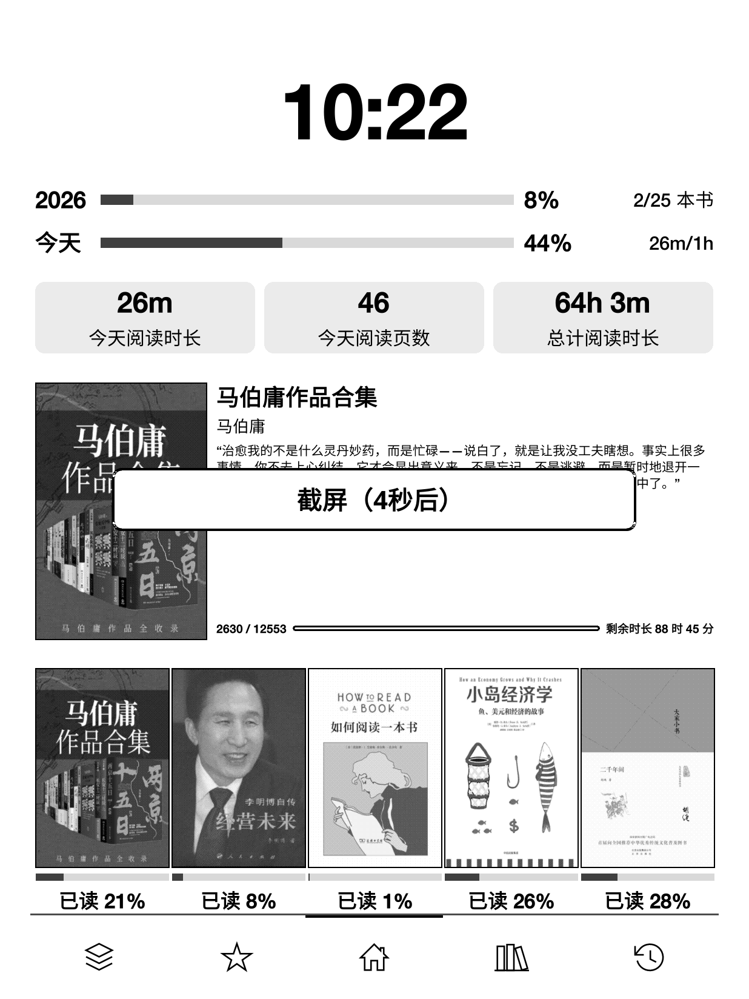
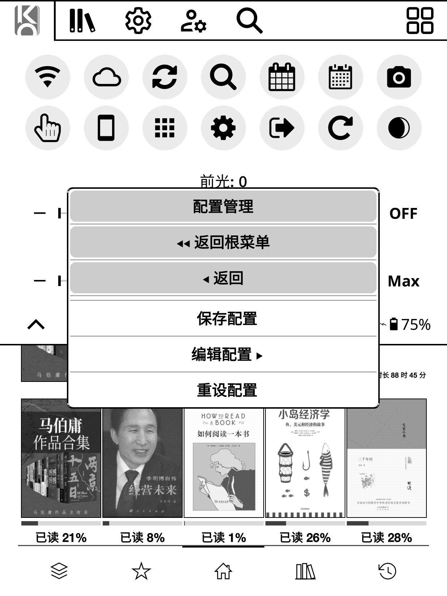

# quickcenter.koplugin

> **KOReader 快捷操作 + 控制中心——一个轻量、可自定义、支持手势的快捷中枢。**

> **作者**：[Arin-Chin](https://github.com/Arin-Chin) · **许可协议**：AGPL-3.0 · **兼容性**：KOReader（LuaJIT）

---

## 📖 概述

QuickCenter 是一个由补丁 `koreader/patches/2-quickcenter.lua`（旧版文件保留在本仓库历史中，供对照）迁移而来的标准 KOReader **插件**。它经官方 PluginLoader 加载：`main.lua` 仅在插件「启用」时执行，且全程不写 `_G`。

| 功能 | 说明 |
| :--- | :--- |
| ⚡ **快捷操作** | 5 种类型的常用操作：录制、编辑、管理；从快捷操作菜单或手势一键运行 |
| 🎛️ **控制中心** | 注入菜单首个标签页的一键操作面板（文件管理器与阅读器通用），含布局、形状、滑块、过滤与手势行为设置 |
| 🖼️ **图标与字体** | 图标选择器（Nerd Font / SVG / PNG）、系统图标替换、整机 UI 字体切换（常规 / 粗体 / 等宽） |



### 📦 快速安装

| 步骤 | 操作 |
| :--- | :--- |
| 1 | 克隆本仓库，将其内容复制到 `<koreader>/plugins/quickcenter.koplugin/` |
| 2 | KOReader → 齿轮菜单 **工具 → 插件管理 → User plugins** → 启用 `QuickCenter` |
| 3 | 重启 KOReader |

> ⚠️ **与旧补丁互斥。** 启用本插件时**请勿**再把 `2-quickcenter.lua` 放进 `koreader/patches/`——两者会重复注入同一菜单标签与设置入口。

| 场景 | 推荐 |
| :--- | :--- |
| 紧跟上游补丁更新 | 继续使用补丁版（见仓库历史） |
| 希望通过插件管理器标准启停 | 使用本插件 |

> 💡 **灵感来源**：[kopatches](https://github.com/gytwo/kopatches) ·
> [quickui.koplugin](https://github.com/gytwo/quickui.koplugin) ·
> [simpleui.koplugin](https://github.com/doctorhetfield-cmd/simpleui.koplugin) ·
> [KOReader.patches](https://github.com/joshuacant/KOReader.patches)

---

## 🚀 核心功能

### 1. ⚡ 快捷操作

| 功能 | 说明 |
| :--- | :--- |
| **自定义动作** | 5 种类型：文件夹 / 收藏 / 插件 / 系统动作 / **录制的菜单动作** |
| **菜单录制** | 将任意菜单路径录制为可复用动作；录制后编辑时可自定义其界面（视图） |
| **编辑操作** | 在编辑卡片中新增 / 重命名 / 删除；自定义动作归入 **自定义操作**，内置动作保留在 **内置操作** |
| **状态标记** | `≡` = 已加入快捷操作菜单 · `⊚` = 已保存为控制中心按钮（显示在名称前，均在编辑卡片中管理） |
| **快捷操作菜单** | 通过编辑卡片勾选增删；手势可唤出无标题栏的运行列表 |

<table>
  <tr>
    <td></td>
    <td></td>
  </tr>
</table>

<table>
  <tr>
    <td></td>
    <td></td>
  </tr>
</table>

### 2. 🎛️ 控制中心

注入顶部菜单**首个标签页**（文件管理器与阅读器通用）的可自定义操作面板，以及它的全部按钮相关设置。

| 设置项 | 选项 / 说明 |
| :--- | :--- |
| **内置动作** | Wi-Fi / 夜间模式 / 旋转 / 截屏（4 秒后）/ 继续阅读 / 搜索 / 重启 / 退出 / 电源 / HTTP 服务器 / 字体列表 / 切换 UI 字体 |
| **排列按钮** | 以 ▲ / ▼ 调整面板按钮顺序（QuickCenter 样式框，含返回导航） |
| **编辑按钮** | 列出已保存为面板按钮的动作；点击或长按移除（等同在编辑卡片中取消“已添加到按钮”） |
| **按钮布局** | 自动（按面板宽度流动排列）/ 固定网格（**行数 × 每行按钮数**） |
| **界面过滤** | 按上下文显示 / 隐藏动作：文件管理器 / 阅读器 / 通用 |
| **按钮形状** | 圆形 / 圆角方形 / 无边框 |
| **按钮背景** | 透明 / 实色 / 浅灰 |
| **滑块样式** | 线条 / 分段按钮 |
| **按钮大小** | 60% ~ 150%（步进 5%，默认 100%） |
| **标签大小** | 50% ~ 200%（步进 10%，默认 90%） |
| **显示标签** | 开关 |
| **长按行为** | 长按按钮 → 编辑 · 长按面板 → 打开设置 |
| **前光 / 色温滑块** | 支持可选数值显示与 Min / Max 快捷键（需设备支持） |


### 3. ⚙️ 设置

通过菜单入口或 `qa_settings_action` 手势打开设置。

| 功能 | 说明 |
| :--- | :--- |
| **启用快捷中心** | 启用 / 停用面板标签页（需重启生效） |
| **配置管理** | 命名预设：**保存** · **编辑** · **重设** |
| **外观设置** | 面板标签图标 · 系统图标替换 · UI 字体切换 |

#### 配置管理

| 功能 | 说明 |
| :--- | :--- |
| **保存配置** | 将当前配置保存为**命名预设** |
| **编辑配置** | 浏览已保存预设：**长按将预设应用到当前设置**；进入子菜单可更新 / 重命名 / 删除 |
| **重设配置** | 恢复出厂默认值 |

> 预设可随时保存、覆盖和恢复——方便在阅读 / 夜间 / 出行等场景间快速切换。




#### 图标选择器

| 来源 | 说明 |
| :--- | :--- |
| **Nerd Font** | 自动扫描符号字体字形，支持码位搜索 |
| **SVG / PNG 文件** | 浏览 `koreader/icons/` 与内置图标目录，支持名称筛选 |
| **系统图标替换** | 替换 KOReader 内置图标（网格预览、批量应用 / 重置） |

#### UI 字体切换

从已安装字体中整体替换 UI 字体（常规 / 粗体 / 等宽），支持实时预览与一键重置。

---

## 🔧 支持

| 入口 | 位置 |
| :--- | :--- |
| **快捷中心设置** | 齿轮菜单 **工具 → More tools → 快捷中心** |
| **控制中心面板** | 顶部菜单首个标签页（图标可配置） |

| 手势动作 | Dispatcher 动作键 | 说明 |
| :--- | :--- | :--- |
| 控制中心面板 | `quick_actions_panel` | 打开控制中心面板标签页 |
| 快捷中心设置 | `qa_settings_action` | 打开快捷中心设置 |
| 快捷操作菜单 | `qa_shortcuts_menu` | 打开快捷操作运行列表（无标题栏） |

> 手势绑定在重启后依然有效——在齿轮菜单 → 手势管理中绑定，存于 `koreader/settings/dispatcher.lua`；动作标题随界面语言本地化。

**启用 / 禁用**：在插件管理器中禁用并重启后，菜单入口、面板标签、手势动作与字体/图标补丁均不再注入（它们只在插件 `main.lua` 被加载时存在）。插件机制不支持运行期解包，切换后请重启；禁用期间若手势仍引用上述三个动作名，执行只会静默无效果。

---

## 📁 文件结构

```
quickcenter.koplugin/            # 仓库根 == 插件根
├── main.lua                     # 入口：插件类与生命周期、动作注册表、面板与
│                                #   对话框、TouchMenu 等补丁安装
├── qc_config.lua                # 配置叶子模块：默认值、序列化、原子保存/加载、
│                                #   设置访问器
├── qc_scan.lua                  # 插件/补丁扫描叶子模块（PluginScan）
├── qc_uifont.lua                # UI 字体切换叶子模块
├── qc_icons.lua                 # 图标叶子模块：Nerd Font、选择器、缓存
├── spec/                        # 单元测试（qc_config）+ 免安装 runner
├── _meta.lua                    # 插件元数据（禁用时仍可显示）
├── .luacheckrc                  # luacheck 配置
├── pictures/                    # 截图（两份 README 共用）
├── README.md                    # 文档（英文）
└── README.zh_CN.md              # 文档（简体中文）
```

| 文件 | 用途 |
| :--- | :--- |
| `main.lua` | 插件入口：快捷操作 + 控制中心 + 配置管理 + 图标 / 字体工具 |
| `qc_config.lua` | 配置存储与访问器（其余模块唯一的叶子依赖） |
| `qc_scan.lua` | 插件 / 补丁发现与菜单项树搜索 |
| `qc_uifont.lua` | 整机 UI 字体替换与选择对话框 |
| `qc_icons.lua` | Nerd Font 字形、图标缓存、文件 / 系统图标选择器 |
| `spec/` | 单元测试与 runner（内存文件系统，不写盘） |
| `_meta.lua` | 插件管理器展示用元数据 |
| `README.md` / `README.zh_CN.md` | 双语文档（结构对位） |

---

## ⚙️ 配置

所有设置保存在 `koreader/settings/quickcenter.lua`（首次运行自动生成；补丁时代的旧配置文件可直接沿用——无需迁移）。

| 分组 | 键名 | 说明 |
| :--- | :--- | :--- |
| 面板 | `qa_enabled` / `qa_slots` / `qa_*` | 面板开关、按钮顺序、形状、大小、标签、滑块 |
| 布局 | `qa_layout_*` | 固定按钮网格（开关 / 行数 / 每行数） |
| 快捷方式 | `qa_shortcuts` | 已加入快捷操作菜单的动作 |
| 预设 | `saved_configs` | 命名配置预设 |
| 外观 | `qa_tab_icon` / `qa_icon_overrides` / `ui_font_overrides` | 面板标签图标、系统图标替换、UI 字体 |

---

## 🌐 国际化

| 项目 | 说明 |
| :--- | :--- |
| 机制 | 界面文案经 gettext `_()` 包裹，随 KOReader 界面语言本地化 |
| 内置默认语言 | 简体中文（代码内置回退文案） |
| 翻译文件 | 本仓库不内置 `.po` 目录（走 KOReader l10n 流程） |

---

## 📦 更新记录

| 日期 | 版本 | 说明 |
| :--- | :--- | :--- |
| 2026-09-11 | 1.0.0 | 首个正式发布：由旧补丁 `2-quickcenter.lua` 迁移为标准 KOReader 插件；模块化结构（`qc_config`/`qc_scan`/`qc_uifont`/`qc_icons`）；PluginLoader 生命周期、不写 `_G`；快捷操作（5 种类型、菜单录制、快捷操作菜单）与状态前缀 `≡`/`⊚`；控制中心面板（网格、形状、背景、大小、标签、滑块、场景过滤）；图标选择与系统图标替换；UI 字体切换；命名配置预设与应用；手势动作；稳定性修复 |
---

## 🔌 兼容性

| 项目 | 要求 |
| :--- | :--- |
| KOReader | 任意较新构建（LuaJIT）；已在 v2026.07 验证 |
| 设备 | 前光 / 色温滑块需设备支持 |
| 图标 | Nerd Font 功能需要 Nerd Font 符号字体 |
| 依赖 | 仅 KOReader 核心 API（无外部库、无 `os.execute`） |
| 配置 | `quickcenter.lua` schema 自补丁时代起不变（`version = 1`） |

---

## 开发者信息

- **作者**: [Arin-Chin](https://github.com/Arin-Chin)
- **许可协议**: AGPL-3.0 —— 见 [gnu.org/licenses/agpl-3.0.zh.html](https://www.gnu.org/licenses/agpl-3.0.zh.html)


